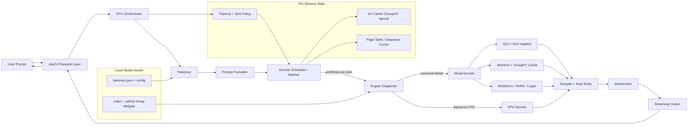

# cellm — Mobile-Native LLM Serving Engine

> A ground-up LLM inference engine for iOS and Android, written in Rust. Brings server-grade serving concepts — paged KV cache, continuous decode scheduling, multi-session concurrency — to phones running under 512MB RAM.

Not a wrapper around `llama.cpp`. Not a port of `vLLM`. A new runtime designed for mobile constraints from scratch.

> [!NOTE]
> This is just a research project—don't get mad at me lol!


## Quick Links

| Resource | Path |
|---|---|
| **Getting Started** | [Quick Start](#quick-start) below |
| **Architecture & Design** | [`docs/project_architecture.md`](docs/project_architecture.md) |
| **Paged KV Cache Deep Dive** | [`docs/paged-kv-cache-foundation.md`](docs/paged-kv-cache-foundation.md) |
| **Benchmarks** | [`docs/benchmarks/README.md`](docs/benchmarks/README.md) |
| **Model Conversion** | [`docs/convert-quantized-models.md`](docs/convert-quantized-models.md) |
| **VLM (Vision) Guide** | [`docs/vlm-smolvlm-onnx.md`](docs/vlm-smolvlm-onnx.md) |
| **iOS Demo App** | [`bindings/ios/CellmDemo`](bindings/ios/CellmDemo) |
| **Android Bindings** | [`bindings/kotlin`](bindings/kotlin) |
| **WASM & WebGPU** | [`docs/wasm-backend.md`](docs/wasm-backend.md) |
| **Live WASM Demo** | [cellm-wasm (](https://jeffasante.github.io/cellm/wasm/index.html) (Research Preview) |

## Quick Start

### Prerequisites
- **Rust 1.75+** (modern stable toolchain)
- **macOS / iOS** for Metal acceleration (Linux/Android builds use CPU path)
- **Git LFS** (for bundled sample models)

### 1. Build
```bash
cargo build --release
```

### 2. Run a smoke test (CPU)
```bash
cargo run --release --bin infer -- \
  --model models/smollm2-135m.cellm \
  --tokenizer models/hf/smollm2-135m/tokenizer.json \
  --prompt "Hello, how are you?" \
  --chat \
  --gen 32
```

### 3. Run with Metal (macOS/iOS)
```bash
cargo run --release --bin infer -- \
  --model models/smollm2-135m-int8.cellm \
  --tokenizer models/hf/smollm2-135m/tokenizer.json \
  --prompt "Hello" \
  --chat \
  --gen 16 \
  --backend metal
```

> **Tip:** Use `--chat` for ChatML-style formatting. Without it, many base models behave like text-completion engines and may not answer directly.

### 4. Metal verification
```bash
cargo run --release --bin metal-smoke
```

---

## Architecture Overview



---

## What Makes cellm Different?

| Feature | `llama.cpp` | `MLX` | `ExecuTorch` | **`cellm`** |
| :--- | :--- | :--- | :--- | :--- |
| **Language** | C++ | C++/Python | C++ | **Rust** |
| **KV Cache** | Contiguous | Contiguous | Contiguous | **Paged (Block-based)** |
| **Focus** | Portability | Apple Native | Model Export | **Mobile Multi-session** |
| **Scheduling** | Static Batch | Mostly Single | N/A | **Round-Robin Interleaved**|
| **Memory** | Manual/Static | Managed Buffer | Static Graph | **Dynamic Block Allocator**|

---

## Project Structure

```
cellm/
├── crates/
│   ├── cellm-core/          # Memory arena, tensor layout, op dispatch
│   ├── cellm-model/         # Model format, configuration, weight management
│   ├── cellm-cache/         # Paged KV cache: BlockAllocator, PageTable, physical storage
│   ├── cellm-kernels/       # CPU, Metal, WASM & WebGPU compute kernels
│   ├── cellm-scheduler/     # Decode scheduler & batching logic
│   ├── cellm-wasm/          # WebAssembly bindings & JavaScript API
│   └── cellm-sdk/           # Public C FFI + high-level API for mobile consumers
├── bindings/
│   ├── ios/CellmDemo/       # SwiftUI demo app (LLM + VLM stub)
│   ├── kotlin/              # Android Kotlin/JNI bindings
│   └── swift/               # Swift Package + XCFramework build scripts
├── tools/
│   ├── infer/               # CLI inference runner (debug & validation)
│   ├── vlm-onnx-infer/      # VLM runner for SmolVLM ONNX exports
│   ├── vlm-smoke/           # SDK FFI VLM smoke test
│   ├── convert/             # HF Safetensors/GGUF/PyTorch -> .cellm converter
│   ├── bench/               # Latency & throughput benchmark harness
│   └── metal-smoke/         # Minimal Metal kernel compile + dispatch test
├── docs/                    # Architecture deep-dives, benchmarks, model guides
└── models/                  # Sample .cellm checkpoints (Git LFS)
```

---

## Development Commands

### Convert a Model
Convert HuggingFace Safetensors or GGUF to `.cellm`:
```bash
cargo run --bin convert -- \
  --input  ./models/hf/smollm2-135m \
  --output ./models/smollm2-135m.cellm \
  --dtype  f16
```

Quantize during conversion:
```bash
cargo run --bin convert -- \
  --input  ./models/hf/smollm2-135m \
  --output ./models/smollm2-135m-int8.cellm \
  --dtype  f16 \
  --quantize-int8-symmetric
```

See [`docs/convert-quantized-models.md`](docs/convert-quantized-models.md) for GGUF, PyTorch, and 4-bit affine workflows.

### Run Benchmarks
```bash
# Quick smoke benchmark
cargo run --release --bin bench -- --model tiny

# Full LLM backend matrix (CPU vs Metal)
tools/bench/run_llm_backend_matrix.sh
```

Detailed benchmark reports live in [`docs/benchmarks/`](docs/benchmarks/).

### Run VLM (Vision-Language)
```bash
# ONNX vision + ONNX decoder (recommended)
cargo build --release -p cellm-vlm-onnx-infer

./target/release/vlm-infer \
  --model-dir models/hf/smolvlm-256m-instruct \
  --onnx-variant fp16 \
  --image models/test_images/rococo.jpg \
  --prompt "Describe this image." \
  --split-image \
  --max-new-tokens 96
```

Native `.cellm` vision + decoder is experimental:
```bash
./target/release/vlm-infer \
  --model-dir models/hf/smolvlm-256m-instruct \
  --cellm-model models/smolvlm-256m.cellm \
  --vision-backend cellm \
  --decoder-backend cellm \
  --image models/test_images/rococo.jpg \
  --prompt "Describe this image." \
  --max-new-tokens 12
```

See [`docs/vlm-smolvlm-onnx.md`](docs/vlm-smolvlm-onnx.md) for full VLM docs.

### iOS SwiftUI Demo
Build the XCFramework:
```bash
./scripts/build_xcframework.sh
```

Then open `bindings/ios/CellmDemo` in Xcode.

### Browser / WebAssembly
Build and run the WASM engine with WebGPU acceleration:
```bash
# Build the WASM module
./scripts/build-wasm.sh --release

# Serve the demo page
python3 -m http.server 8080 --directory crates/cellm-wasm/www/
```
Then open `http://localhost:8080` and use `engine.try_init_webgpu()` to enable hardware acceleration.

---

## Supported Models

| Model | Size | Best For | Notes |
|---|---|---|---|
| **SmolLM2** | 135M-360M | Fast smoke tests, small devices | Best LLM starter model |
| **LFM2.5** | 350M | Long-context, efficient inference | Linear attention, up to 256K context |
| **Qwen2.5 / Qwen3.0 / Qwen3.5** | 0.5B-0.8B | Multilingual, reasoning | DeltaNet layers supported (CPU ref) |
| **Gemma-3** | 1B | Quality vs size tradeoff | Metal path active, CPU-safe fallback |
| **Bonsai** | 1.7B | High-quality local chat | 1-bit quantized; see `docs/bonsai_1bit_analysis.md` |
| **Gemma-4** | 2B-4B | Larger mobile workloads | Experimental; see `docs/gemma4_*` |
| **SmolVLM** | 256M | Vision-language (ONNX) | Native `.cellm` VLM path in progress |
| **FunctionGemma** | 270M | Mobile actions / tool use | Experimental quality |

Recommended first download: [`SmolLM2-135M`](https://huggingface.co/HuggingFaceTB/SmolLM2-135M/tree/main)

Sample checkpoints bundled in this repo (via Git LFS):
- `models/smollm2-135m-int8.cellm`
- `models/smolvlm-256m-int8.cellm`
- `models/qwen3.5-0.8b-int4-textonly.cellm`

---

## Feature Status

- [x] **Paged KV Cache** - Fixed-size block allocation with `BlockAllocator` & `PageTable`
- [x] **Multi-session Scheduler** - Round-robin interleaved decoding
- [x] **4-bit Affine Dequantization** - Native MLX/HF packed weight support
- [x] **Multimodal Vision** - Native ViT/SigLIP encoder + linear projector
- [x] **Accelerated Math** - Metal + WASM SIMD + WebGPU compute kernels
- [x] **WebAssembly Support** - Run LLMs in the browser with `wasm-bindgen`
- [x] **High-Performance CLI** - Conversion, benchmarking, debug inference
- [ ] **Vulkan Support** - Cross-platform compute kernels (research)
- [ ] **Android Integration** - Kotlin/JNI bindings & tuning (coming soon)
- [ ] **Qwen iOS Porting** - Optimize Qwen inference for native iOS

---

## Documentation Index

| Topic | Doc |
|---|---|
| Architecture & crate design | [`docs/project_architecture.md`](docs/project_architecture.md) |
| Paged KV cache internals | [`docs/paged-kv-cache-foundation.md`](docs/paged-kv-cache-foundation.md) |
| Scheduler & continuous batching | [`docs/phase4-continuous-batching.md`](docs/phase4-continuous-batching.md) |
| Model conversion & quantization | [`docs/convert-quantized-models.md`](docs/convert-quantized-models.md) |
| TurboQuant KV compression | [`docs/turboquant_dataflow.md`](docs/turboquant_dataflow.md) |
| VLM / SmolVLM ONNX guide | [`docs/vlm-smolvlm-onnx.md`](docs/vlm-smolvlm-onnx.md) |
| VLM sequence tracking | [`docs/cellm-vlm-sequence.md`](docs/cellm-vlm-sequence.md) |
| Qwen3.5 / DeltaNet | [`docs/qwen3_5-deltanet.md`](docs/qwen3_5-deltanet.md) |
| Metal acceleration notes | [`docs/LFM_Metal_Acceleration.md`](docs/LFM_Metal_Acceleration.md) |
| Benchmark history & raw runs | [`docs/benchmarks/`](docs/benchmarks/) |
| Data flow diagrams | [`docs/data_flow.md`](docs/data_flow.md) |
| Format specification | [`docs/format.md`](docs/format.md) |
| Inference graph | [`docs/inference_graph.md`](docs/inference_graph.md) |
| WASM & WebGPU Backend | [`docs/wasm-backend.md`](docs/wasm-backend.md) |

---

## Troubleshooting

### Metal is not being used
```bash
# 1. Verify Metal device access
cargo run --release --bin metal-smoke

# 2. Verify infer picks Metal
./target/release/infer \
  --model models/smollm2-135m-int8.cellm \
  --tokenizer models/hf/smollm2-135m/tokenizer.json \
  --prompt "hello" --gen 8 --backend metal
```

In restricted/sandboxed shells, Metal device discovery can fail. `infer --backend metal` now **errors** instead of silently falling back to CPU.

### SmolLM2 360M needs non-interleaved RoPE
```bash
CELLM_LLAMA_ROPE_INTERLEAVED=0 ./target/release/infer ...
```

### Gemma-3 Metal quality knobs
Default keeps norm/RoPE/logits on CPU-safe path for quality parity. Opt-in Metal paths:
```bash
CELLM_GEMMA_USE_METAL_NORM=1   # enable Metal RMSNorm
CELLM_GEMMA_USE_METAL_ROPE=1   # enable Metal RoPE
CELLM_GEMMA_USE_METAL_LOGITS=1 # enable Metal final logits matvec
```

### Llama graph path (experimental speed)
```bash
CELLM_LLAMA_ENABLE_GRAPH=1 ./target/release/infer ...
```

### Model-specific env flags
| Model | Flag | Purpose |
|---|---|---|
| SmolLM2 360M | `CELLM_LLAMA_ROPE_INTERLEAVED=0` | Correct RoPE layout |
| Llama | `CELLM_LLAMA_USE_METAL_NORM=1` | Force Metal norm |
| Llama | `CELLM_LLAMA_USE_METAL_ROPE=1` | Force Metal RoPE |
| Qwen VLM | `CELLM_VLM_TOKENIZER=...` | Set tokenizer path for vlm-smoke |

For more debug flags and backend-specific notes, see the per-model docs in `docs/`.

---


## License

Licensed under either of:

- MIT license (`LICENSE-MIT`)
- Apache License, Version 2.0 (`LICENSE-APACHE`)

at your option.
