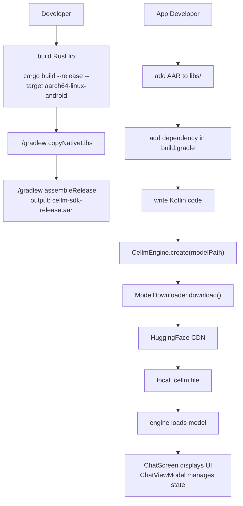

# Building the Android AAR

This guide explains how developers can build the cellm Android AAR from
source. The AAR contains the Kotlin SDK (engine wrapper, tokenizer, model
downloader, and Jetpack Compose chat UI) plus the native Rust library
compiled for arm64-v8a.

The current AAR is 157KB (Kotlin code and Compose UI only, native .so not
included since cross-compilation requires the Android NDK).

---

## Prerequisites

| Tool | Version | Install |
|---|---|---|
| Android SDK | 34+ | Android Studio or `sdkmanager` |
| JDK | 17 | `brew install openjdk@17` (macOS) or `apt install openjdk-17-jdk` (Linux) |
| Rust | 1.75+ | `rustup` |
| Android NDK | 26+ | `sdkmanager "ndk;26.0.10792822"` |
| Rust target | aarch64-linux-android | `rustup target add aarch64-linux-android` |

Verify your setup:

```bash
echo $ANDROID_HOME   # should point to your Android SDK
echo $JAVA_HOME      # should point to JDK 17
rustup target list | grep aarch64-linux-android
```

---

## Project Structure

```
bindings/kotlin/
  build.gradle              AGP 8.2.0, Compose, Kotlin 1.9.20
  settings.gradle           project settings
  gradle.properties         JVM args, AndroidX
  local.properties          sdk.dir path
  gradlew                   wrapper script
  gradle/wrapper/           gradle-wrapper.jar + properties
  
  src/main/
    kotlin/com/cellm/sdk/
      CellmEngine.kt        C FFI wrapper (all engine ops)
      CellmSession.kt       session handle
      CellmTokenizer.kt     tokenizer wrapper
      ModelDownloader.kt    HuggingFace model downloader
      ChatViewModel.kt      Android ViewModel with streaming decode
      ChatScreen.kt         Jetpack Compose chat UI
      ModelPickerScreen.kt  Compose model picker UI
    jniLibs/
      arm64-v8a/            native .so files (populated by gradle task)
```

---

## Step 1: Compile the Rust library for Android

Set up the Android NDK linker. Create `~/.cargo/config.toml`:

```toml
[target.aarch64-linux-android]
linker = "aarch64-linux-android34-clang"
```

Build the library:

```bash
cargo build --release --target aarch64-linux-android -p cellm-sdk
```

The output is `target/aarch64-linux-android/release/libcellm_sdk.so`.

---

## Step 2: Copy the native library

```bash
cd bindings/kotlin
./gradlew copyNativeLibs
```

This copies `libcellm_sdk.so` into `src/main/jniLibs/arm64-v8a/`.

If you are building the AAR for distribution without the native library (for
example, if users will provide their own compiled `.so`), skip this step.
The AAR will still contain the Kotlin SDK classes but will fail at runtime
unless a compatible `.so` is loaded separately.

---

## Step 3: Build the AAR

```bash
cd bindings/kotlin
./gradlew assembleRelease
```

The output is `build/outputs/aar/cellm-sdk-release.aar`.

---

## Step 4: Verify the AAR contents

```bash
# AAR is a zip file; inspect its contents
unzip -l build/outputs/aar/cellm-sdk-release.aar
```

Expected contents:

```
AndroidManifest.xml
classes.jar                    Kotlin bytecode (engine, tokenizer, UI)
jni/arm64-v8a/libcellm_sdk.so  Native Rust library (if copied)
R.txt                          Android resources
```

---

## Using the AAR in an Android App

Add the AAR to your app's `libs/` directory and reference it in `build.gradle`:

```groovy
// app/build.gradle
dependencies {
    implementation files('libs/cellm-sdk-release.aar')
    
    // Required transitive dependencies
    implementation platform('androidx.compose:compose-bom:2023.10.01')
    implementation 'androidx.compose.ui:ui'
    implementation 'androidx.compose.material3:material3'
    implementation 'androidx.lifecycle:lifecycle-viewmodel-compose:2.6.2'
}
```

---

## Model Download and Inference Flow



---

## Common Issues

**`glslangValidator not found` during Rust build**

The Vulkan shader compilation step requires `glslangValidator`. Install it:

```bash
brew install glslang
```

Or set `GLSLANG_VALIDATOR` to the binary path. The build will skip SPIR-V
compilation and use stubs if the tool is absent.

**`SDK XML version 4` warning**

This is harmless. It means your SDK build-tools are newer than what AGP 8.2.0
expects. Update AGP to 8.4+ or install build-tools 34.0.0.

**AAR too large (includes Compose UI)**

The AAR includes Jetpack Compose UI classes (ChatScreen, ModelPickerScreen)
which are 157KB. If you only need the engine wrapper (CellmEngine, CellmSession,
CellmTokenizer), remove the UI files and the Compose dependencies from
build.gradle. The AAR will shrink to approximately 30KB.

**`libcellm_sdk.so` not found at runtime**

Make sure you ran `copyNativeLibs` before assembling the AAR, or manually
place the `.so` in `src/main/jniLibs/arm64-v8a/`. The library must be
compiled for `aarch64-linux-android` (arm64-v8a), not for the host platform.

---

## File Sizes

| File | Size |
|---|---|
| cellm-sdk-release.aar (Kotlin + Compose only) | 157KB |
| cellm-sdk-release.aar (with native .so for SmolLM2 360M) | ~4.5MB |
| cellm-sdk-release.aar (with native .so for Gemma 4 2B) | ~4.5MB |

The native `.so` includes the full cellm engine (scheduler, KV cache, kernel
dispatch, Metal/Vulkan backends). The `.so` size is constant regardless of
which model is loaded; model weights are downloaded separately at runtime.
