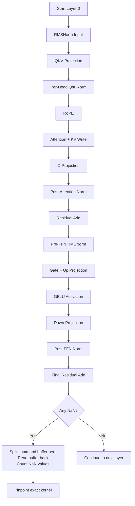

# Fixing Gemma Metal Graph NaN Divergence

**Date:** April 30, 2026

## The Problem

Gemma models on the Metal fused-graph backend produced NaN values immediately at the first decode step. The error message was always the same:

```
GemmaGraphState: divergence at pos 0 (NaN=262144 Inf=0), disabling
```

All 262144 logits became NaN, so the fused graph disabled itself and fell back to the slow CPU path. The same model worked fine on CPU.

## The Debugging Process

The fused graph runs many kernels in one command buffer. When everything is NaN at the end, you do not know which kernel failed. The approach was to add checkpoints inside `step_fused` that commit the command buffer after each major operation, read the buffer back to the CPU, and count NaN values.



### Checkpoint Results

Running with the debug checkpoints showed a clear pattern:

1. **Attention path** (norm, QKV, RoPE, attention, O-proj, residual): zero NaNs
2. **Pre-FFN norm**: zero NaNs
3. **Gate + Up projection**: zero NaNs
4. **GELU activation**: **1 NaN** appeared
5. **Down projection**: **1152 NaNs** (the entire hidden dimension)
6. **Post-FFN norm and residual**: 1152 NaNs (propagated)

The single NaN from GELU spread through the down projection to corrupt the whole hidden state.

## Root Cause

The GELU kernel uses `tanh` inside the approximation formula. Both the element-ops library and the KV-cache library were compiled with Metal fast-math enabled:

```rust
let options = metal::CompileOptions::new();
options.set_fast_math_enabled(true);
```

Fast-math replaces the exact IEEE `tanh` with a cheaper hardware approximation. On Apple Silicon, this approximation can return NaN for certain input values that the exact implementation handles correctly. In the GELU kernel, the intermediate expression `v = c * (x + 0.044715 * x * x * x)` can land in this bad region.

The CPU fallback uses Rust's `f32::tanh()`, which is fully IEEE-compliant, so the CPU path never saw the NaN.

## The Fix

Turn off fast-math in both shader compilation sites. This forces Metal to use the exact `tanh` implementation.

**File:** `cellm-kernels/src/metal.rs`

```rust
options.set_fast_math_enabled(false);
```

**File:** `cellm-cache/src/kvcache.rs`

```rust
options.set_fast_math_enabled(false);
```

## Verification

After the fix, the fused graph stays enabled and produces valid tokens:

```
gemma: fused Metal graph enabled (Gemma3, 26 layers)
Prefill: 10 tokens in 0.55s
Decode: 48 tokens in 1.72s
```

The NaN count at every checkpoint drops to zero. The logits buffer contains real values, not NaN. The model generates coherent text on both short and long prompts.

## Why This Matters

Fast-math is usually safe for graphics workloads where small errors are invisible. For neural networks, a single NaN propagates and destroys the entire output. Turning it off costs a small amount of performance but guarantees numerical stability.

## Timeline


