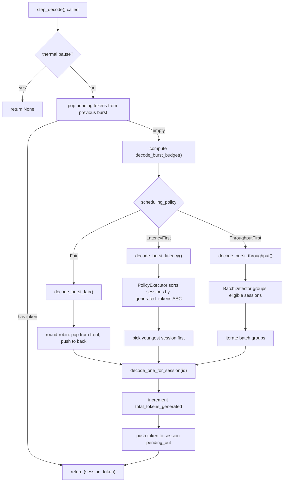
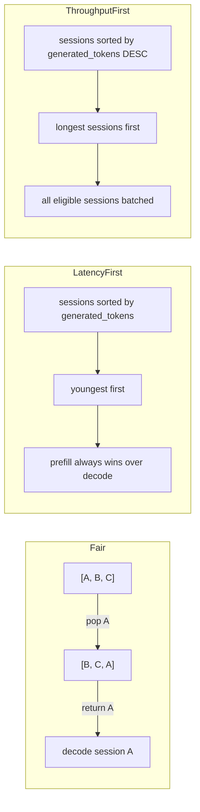
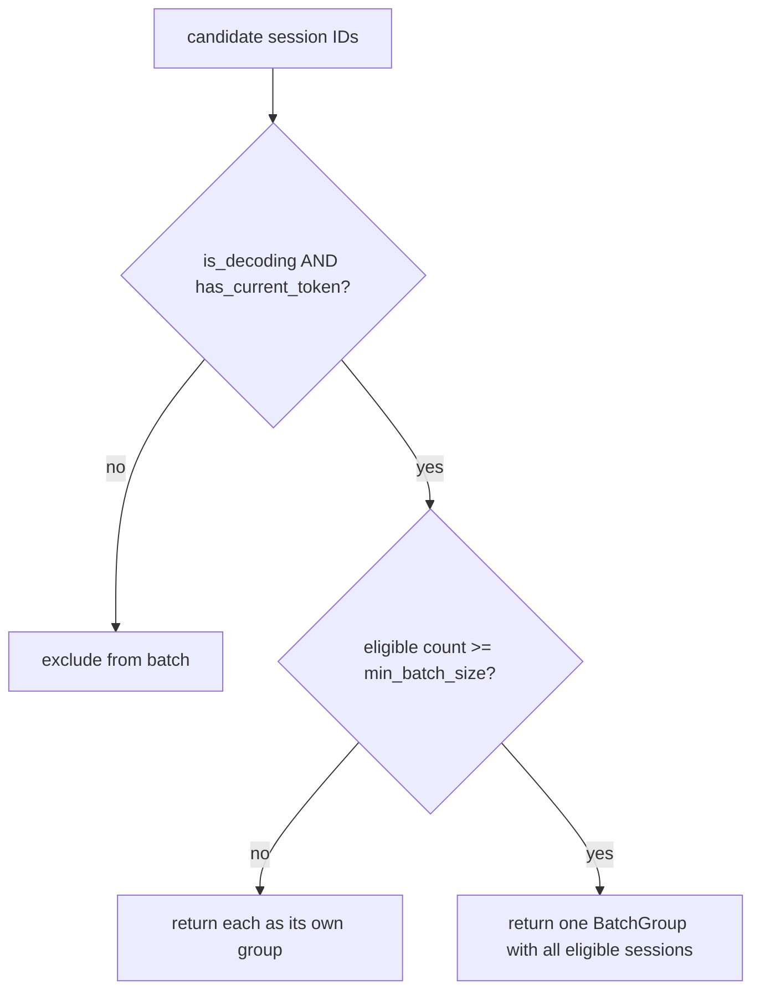

# Phase 4: Continuous Batching Lite & Scheduling Policies

This document describes the continuous batching implementation and multi-policy
scheduler added to cellm as part of Phase 4, along with the Q4_K dtype and
expanded engine statistics.

---

## What Was Implemented

The implementation addresses five gaps identified during the Phase 6 audit:

1.  **Continuous batching lite** -- batch-compatible session detection and grouped
    decode scheduling, optimized for mobile (2-4 concurrent sessions).
2.  **SchedulingPolicy** -- three policies (Fair, LatencyFirst, ThroughputFirst)
    that govern how decode time is allocated across sessions.
3.  **Q4_K dtype** -- 4-bit grouped quantization type added to the DType enum.
4.  **EngineStats expansion** -- `total_tokens_generated` and
    `current_tok_per_sec` fields, plus tok/s measurement window.
5.  **C FFI surface** -- new functions to control scheduling policy and query
    token throughput from Swift/Kotlin.

All changes are additive. No existing behavior was modified for the Fair
(default) policy, which preserves the original round-robin decode semantics.

---

## Architecture

### Data Flow: Policy-Driven Decode



### PolicyExecutor Tick Logic



### BatchDetector Decision



---

## New Crate: `cellm-scheduler::policy`

### SchedulingPolicy Enum

```
SchedulingPolicy::Fair            -- round-robin, equal time slices (default)
SchedulingPolicy::LatencyFirst    -- minimize TTFT, prefill priority, youngest first
SchedulingPolicy::ThroughputFirst -- maximize tok/s, batch all eligible, longest first
```

### PolicyExecutor

Wraps a `VecDeque<SessionId>` and reorders it according to the active policy.
Each call to `tick()` returns a `SchedulingPlan` with the ordered list of
session IDs to decode.

The `Engine` calls `policy_exec.tick()` inside `pump_decode_burst()` to
determine which sessions to service and in what order.

### SchedulingPlan

```
pub struct SchedulingPlan {
    pub decode_ids: Vec<SessionId>,       // ordered decode targets
    pub prefill_ids: Vec<SessionId>,      // sessions to prefill this tick
    pub batch_groups: Vec<Vec<SessionId>>,// batched groups (reserved)
}
```

---

## New Crate: `cellm-scheduler::batch`

### BatchDetector

Scans active sessions and groups decode-ready sessions into `BatchGroup`s.
On mobile with 2-4 sessions and a single loaded model, all eligible sessions
form one batch group.

A session is batch-eligible when:
- It is in the `Decoding` state.
- It has a current token (`last_token` is `Some`).

### BatchGroup

```
pub struct BatchGroup {
    pub session_ids: Vec<SessionId>,
    pub tokens_per_session: usize,   // 1 for decode-phase batching
}
```

### BatchSessionInfo

Lightweight snapshot built by the Engine before calling the detector:

```
pub struct BatchSessionInfo {
    pub is_decoding: bool,
    pub has_current_token: bool,
    pub token_count: usize,          // for throughput priority ordering
}
```

---

## Scheduling Behavior by Policy

| Policy          | Prefill Handling               | Decode Order                          | Batching         |
|-----------------|---------------------------------|---------------------------------------|------------------|
| Fair            | Queued sessions wait their turn | Round-robin, one token per tick       | None             |
| LatencyFirst    | Prefill always wins immediately | Youngest session first (fewest tokens)| None             |
| ThroughputFirst | Deferred until decode burst     | Longest session first (most tokens)   | All eligible     |

Thermal policy overrides all scheduling. If `ThermalLevel::Emergency` is set,
`step_decode` returns `None` immediately regardless of the active scheduling
policy.

---

## Q4_K DType

The `Q4_K` variant was added to the `DType` enum in `cellm-core`. It represents
4-bit grouped quantization with a block size of 256 and groups of 32 elements
sharing a scale factor. This matches the GGUF/GGML Q4_K format and the
quantization scheme used by llama.cpp for 4-bit models.

The `is_quantized()` method now returns `true` for `Q4_K`, enabling backend
dispatch to dequantization-aware matmul kernels.

---

## EngineStats Expansion

Two new fields were added to `EngineStats`:

| Field                     | Type    | Description                                              |
|---------------------------|---------|----------------------------------------------------------|
| `total_tokens_generated`  | `u64`   | Lifetime tokens produced across all sessions             |
| `current_tok_per_sec`     | `f64`   | Tokens per second since last `reset_stats_window()` call |
| `scheduling_policy`       | `SchedulingPolicy` | Active scheduling policy                      |

The tok/s measurement uses a sliding window. Call `reset_stats_window()` to
start a new measurement interval, then read `current_tok_per_sec` from
`EngineStats` to get the average throughput over that interval.

---

## C FFI Additions

```
// Scheduling policy (0=Fair, 1=LatencyFirst, 2=ThroughputFirst)
int32_t  cellm_engine_set_scheduling_policy(cellm_engine_t engine, uint32_t policy);
uint32_t cellm_engine_scheduling_policy(cellm_engine_t engine);

// Token statistics
uint64_t cellm_engine_total_tokens(cellm_engine_t engine);
int32_t  cellm_engine_tok_per_sec(cellm_engine_t engine, double* out_tok_per_sec);
int32_t  cellm_engine_reset_stats_window(cellm_engine_t engine);
```

---

## Files Changed

### New files

```
crates/cellm-scheduler/src/policy.rs    SchedulingPolicy + PolicyExecutor
crates/cellm-scheduler/src/batch.rs     BatchDetector + BatchGroup
```

### Modified files

```
crates/cellm-core/src/dtype.rs          Added Q4_K variant
crates/cellm-scheduler/src/lib.rs       Exported policy and batch modules
crates/cellm-sdk/src/lib.rs             EngineConfig, Engine, EngineStats, decode dispatch
crates/cellm-sdk/src/ffi.rs             C FFI for scheduling policy and stats
crates/cellm-sdk/include/cellm.h        C header declarations
```

### Pre-existing bugs fixed

```
crates/cellm-model/src/llama.rs         Added attention_softcap to ModelConfig
crates/cellm-model/src/gemma.rs         Added attention_softcap; fixed seq_len -> seq
crates/cellm-model/src/qwen.rs          Added attention_softcap to ModelConfig
crates/cellm-model/src/granite.rs       Added attention_softcap to ModelConfig
crates/cellm-model/src/lfm.rs           Added attention_softcap to ModelConfig
```

---

## Test Coverage

```
crates/cellm-scheduler/tests (19 tests, 0 failures):
  policy::fair_round_robin_rotates
  policy::fair_empty_returns_empty_plan
  policy::latency_first_picks_youngest
  policy::latency_first_prefill_priority
  policy::throughput_first_batches_all
  policy::policy_switch_clears_ordering
  batch::batch_detector_groups_eligible_sessions
  batch::batch_detector_filters_non_decoding
  batch::batch_detector_below_min_returns_singletons
  batch::batch_detector_filters_no_token
  batch::split_by_max_batch
  batch::split_empty_group
  batch::batch_group_properties
  Plus 6 existing scheduler tests (session, rr, queue, thermal)
```

---

## How to Use

### From Rust

```rust
use cellm_sdk::{Engine, EngineConfig};
use cellm_scheduler::SchedulingPolicy;

let mut cfg = EngineConfig::default();
cfg.scheduling_policy = SchedulingPolicy::ThroughputFirst;
let mut engine = Engine::new(model_path, cfg)?;

// Later, switch policy at runtime:
engine.set_scheduling_policy(SchedulingPolicy::LatencyFirst);

// Check throughput:
let stats = engine.stats();
println!("tok/s: {:.1}", stats.current_tok_per_sec);
println!("total: {}", stats.total_tokens_generated);
```

### From Swift (via C FFI)

```swift
// Set throughput-first batching
cellm_engine_set_scheduling_policy(engine, 2)

// Read throughput
var tokPerSec: Double = 0
cellm_engine_tok_per_sec(engine, &tokPerSec)
print("tok/s: \(tokPerSec)")

// Reset measurement window
cellm_engine_reset_stats_window(engine)
```
