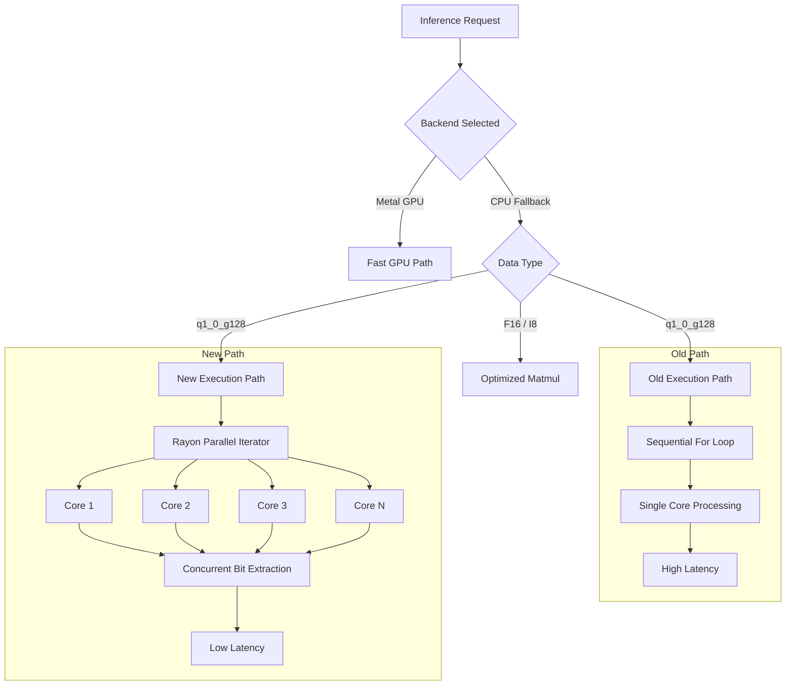

# Q1_0_G128 CPU Optimization

April 26, 2026

This document explains how we solved the severe CPU bottleneck when running extremely quantized models like Bonsai 1.7B.

## The Problem

When running the Bonsai model on the CPU fallback backend, inference was extremely slow. It took over 26 seconds to prefill 7 tokens and about 3 seconds per token to decode. 

We noticed that the CPU usage was stuck at exactly 103 percent. This indicated that the entire inference process was running on a single CPU core, failing to utilize the multi-core architecture of Apple Silicon devices.

Upon investigation, we found the root cause in the Qwen runner file. The Bonsai model is quantized to the `q1_0_g128` format, which is a 1.5 bit format with a group size of 128. For this specific data type, the CPU fallback path was executing a sequential loop over the output dimensions. For every row, it called a function that individually loaded tensor blocks and performed scalar bit extraction on a single thread. This forced the processor to compute billions of operations sequentially.

## The Solution

To fix this, we removed the sequential loop and replaced it with a custom, highly parallelized function. We used the Rayon data parallelism library to distribute the bitwise matrix multiplication across all available CPU cores.

By explicitly using a parallel mutable iterator and setting a minimum chunk size, we instructed the runtime to split the output matrix rows into independent tasks. These tasks are then processed concurrently by the global thread pool.

## Code Execution Map

Here is a diagram showing the difference between the old and new execution paths:

## The Results

By parallelizing the execution, we achieved massive improvements:

* **Prefill time** dropped from 22.25 seconds to 2.13 seconds.
* **Decode latency** dropped from 3.14 seconds per token to 278 milliseconds per token.
* **CPU Usage** increased from 103 percent to nearly 600 percent, proving that the workload is now fully utilizing multiple cores.

This represents an 11x performance speedup, completely resolving the severe inference delays on the CPU backend.
