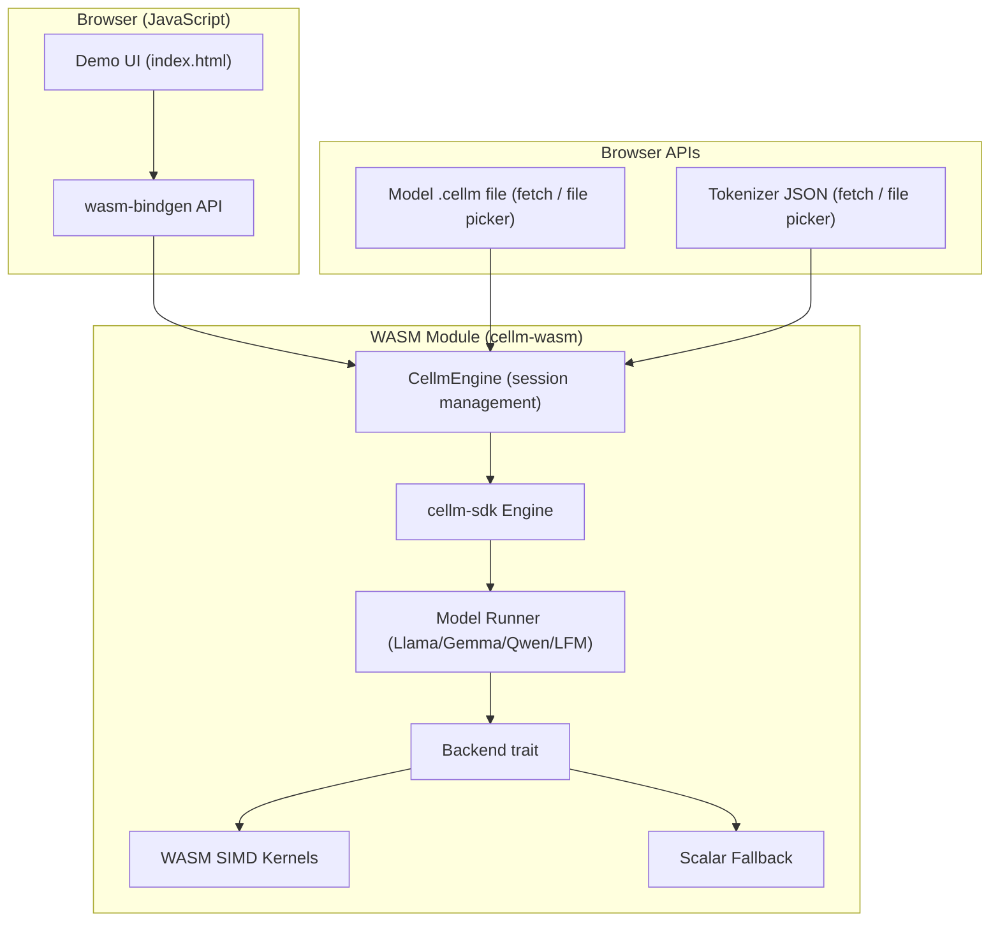
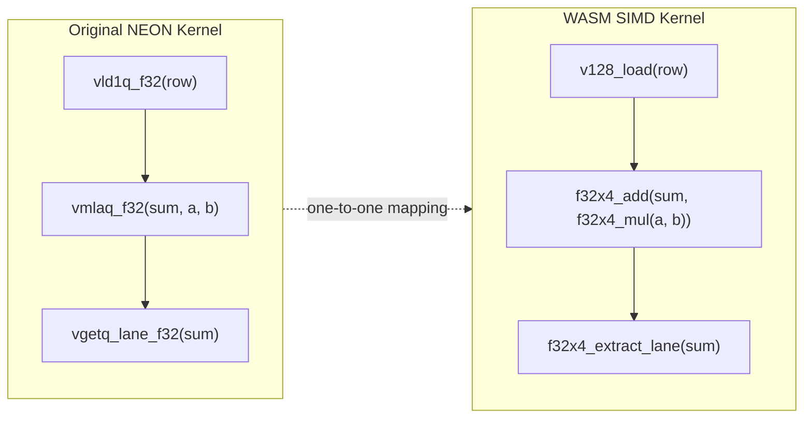
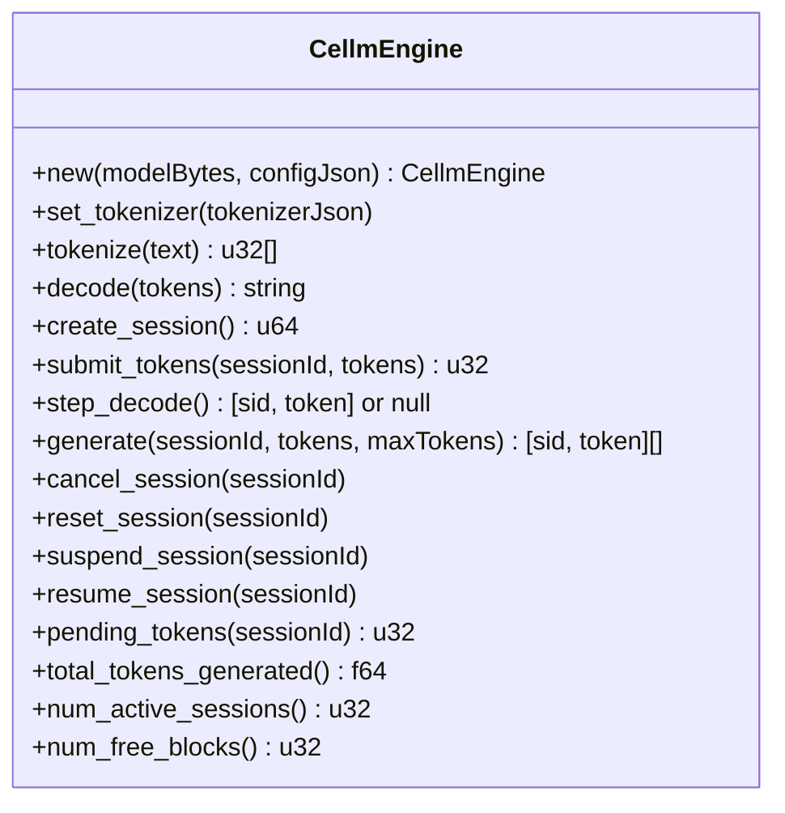
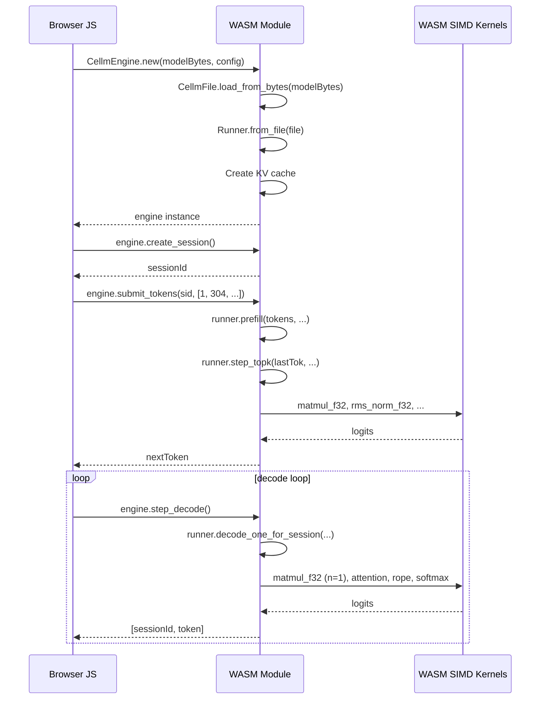

# WebAssembly Backend for cellm

This document describes how the cellm LLM inference engine was ported to
WebAssembly, the design decisions involved, and how the pieces fit together.

> [!TIP]
> **[Try the Live WebAssembly Demo](wasm/index.html)**

## Architecture Overview

The cellm engine already had a clean backend abstraction via the `Backend` trait
in `cellm-core`. The WASM port slots into this same seam, adding a new backend
that compiles to `wasm32-unknown-unknown` while reusing every layer above it:
scheduling, KV cache, model graph traversal, and session management.



## What Was Built

### 1. WASM SIMD Kernels (`cellm-kernels/src/wasm.rs`)

9 kernel functions mirroring the existing NEON-accelerated CPU kernels, using
`std::arch::wasm32` v128 SIMD intrinsics instead of `std::arch::aarch64` NEON.

The translation is nearly one-to-one because both architectures use 128-bit
SIMD registers with 4x f32 lanes:

| NEON Intrinsic | WASM SIMD Equivalent |
|---|---|
| `vld1q_f32(ptr)` | `v128_load(ptr as *const v128)` |
| `vdupq_n_f32(x)` | `f32x4_splat(x)` |
| `vmlaq_f32(acc, a, b)` | `f32x4_add(acc, f32x4_mul(a, b))` |
| `vgetq_lane_f32(v, i)` | `f32x4_extract_lane::<i>(v)` |
| `vst1q_f32(ptr, v)` | `v128_store(ptr as *mut v128, v)` |
| `vld1q_s8(ptr)` | `v128_load(ptr as *const v128)` |
| `vmovl_s8(wv)` | `i16x8_extend_low_i8x16_s` / `i16x8_extend_high_i8x16_s` |
| `vcvtq_f32_s32(wv)` | `f32x4_convert_i32x4_s(wv)` |

Matrix-vector products (the decode-time bottleneck) use a 4-way unrolled dot
product that processes 16 floats per loop iteration. The int8 matmul loads 16
int8 weight values, extends them through i16 to i32, converts to f32, and
multiply-accumulates against 16 f32 activations -- all with register-only
operations.

Each function has `#[cfg(target_arch = "wasm32")]` SIMD blocks and scalar
fallbacks under `#[cfg(not(target_arch = "wasm32"))]`, so the file compiles on
any target.



### 2. Model Loading from Bytes (`cellm-model/src/cellm_file.rs`)

The existing `CellmFile` already supported an owned `Vec<u8>` data variant as a
fallback when `mmap` failed. A new `load_from_bytes(bytes: &[u8])` constructor
was added that:

1. Validates the magic header (`CELLM` + version byte)
2. Parses the JSON header section
3. Builds the tensor index map
4. Wraps the bytes in `CellmData::Owned`

This avoids any filesystem dependency -- critical for WASM where `mmap` does
not exist.

### 3. Runner `from_file` Constructors (`cellm-model/src/{llama,gemma,qwen,lfm}.rs`)

Each model runner previously required a filesystem path:

```rust
pub fn load(path: &Path) -> Result<Self, CoreError> {
    let file = CellmFile::load(path)?;
    // ... extract config, detect prefix ...
}
```

A parallel `from_file(file: CellmFile)` constructor was added to each runner
that skips the `CellmFile::load` call and uses the passed-in file directly.
The WASM engine calls `CellmFile::load_from_bytes` then dispatches to the
appropriate `from_file`.

### 4. Engine `from_bytes` Constructor (`cellm-sdk/src/lib.rs`)

The top-level `Engine::new(path, config)` was mirrored as
`Engine::from_bytes(model_bytes, config)`. It follows the exact same setup
sequence -- extract model type, construct runner, compute head dimension,
allocate KV cache -- but from in-memory bytes instead of a file path.

### 5. WASM Bindings Crate (`cellm-wasm/`)

A new workspace crate `cellm-wasm` exposes the engine to JavaScript via
`wasm-bindgen`:



The API is designed for two usage patterns:

**Manual stepping** -- gives the caller control over decode pacing, useful for
responsive UIs:

```js
const sid = engine.create_session();
engine.submit_tokens(sid, inputIds);

while (true) {
    const result = engine.step_decode();
    if (!result) break;
    const [sid, token] = result;
    output += engine.decode([token]);
    if (isEos(token)) break;
    await sleep(0); // yield to browser
}
```

**Batched generate** -- convenience wrapper that runs a decode loop server-side
and returns all tokens at once:

```js
const results = engine.generate(sid, inputIds, 64);
```

### 6. Threading with Web Workers

The SIMD kernels use `rayon` for parallel iteration across rows in matrix
operations. Under WASM, this requires `SharedArrayBuffer` support, which is
enabled by two HTTP headers on the serving page:

```
Cross-Origin-Opener-Policy: same-origin
Cross-Origin-Embedder-Policy: require-corp
```

The `wasm-bindgen-rayon` crate bridges Rayon's thread pool to browser Web
Workers, spawning a worker pool at WASM initialisation time.

## Data Flow During Inference



## Performance Considerations

**WASM SIMD is competitive for small models.** The 128-bit SIMD width matches
NEON exactly, and the 4-way unrolled dot product is the same algorithm. For
models under 1B parameters (like SmolLM2-135M), the decode path is
compute-bound within the matmul, and WASM SIMD delivers roughly equivalent
per-cycle throughput to native ARM NEON.

**No GPU fallback.** Unlike the Metal and Vulkan backends, WASM currently has
no GPU compute path. WebGPU compute shaders (WGSL) are an option for the
future but require tiled matmul kernels that do not exist yet in the codebase.
For now, all operations run on the CPU via SIMD.

**Threading is有限 by worker count.** Rayon in WASM uses a fixed worker pool
(typically `navigator.hardwareConcurrency` workers). Each worker is a Web
Worker with its own v128 SIMD unit, so parallelisation across matrix rows
scales linearly up to the available core count.

**Model loading is an upfront cost.** Because WASM cannot mmap, the entire
model file must be copied into WASM linear memory before inference begins. For
a 135M int8 model this is roughly 270 MB. For models above 1B parameters,
chunked loading from IndexedDB would be needed to avoid excessive memory usage.

## Build and Test

```bash
# Install tools
cargo install wasm-pack

# Build the WASM module
./scripts/build-wasm.sh --release

# Output goes to crates/cellm-wasm/pkg/
# Serve the demo page:
python3 -m http.server 8080 \
    --directory crates/cellm-wasm/www/

# Open http://localhost:8080 in a browser
```

The demo page requires `Cross-Origin-Opener-Policy` and
`Cross-Origin-Embedder-Policy` headers for `SharedArrayBuffer` support. When
serving with `python3 -m http.server`, these headers are not set and the page
will fall back to single-threaded execution. For full threading, serve with a
server that adds these headers, or use the `wasm-pack` test server:

```bash
wasm-pack test --firefox --headless
```

## Limitations and Future Work

- WebGPU compute shaders for 10-50x acceleration on large matmuls
- Speculative decoding to reduce per-token latency
- Chunked model loading from IndexedDB for models above 1B parameters
- Streaming model fetch (decode while still downloading weights)
- SIMD within a worker is limited to 128-bit lanes; future WASM relaxed SIMD
  and AMX-like extensions will narrow the gap to native Apple Silicon
